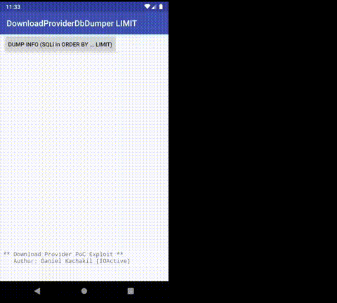

# AOSP-DownloadProviderDbDumperSQLiLimit
PoC Exploiting SQL Injection in Android's Download Provider in Sort Parameter (CVE-2019-2196)

## Security Advisory
[Android (AOSP) Download Provider SQL Injection in Query Sort Parameter (CVE-2019-2196)](https://act-on.ioactive.com/acton/attachment/34793/f-5c01ebda-2cb5-47b9-9330-2d71b3a34db6/1/-/-/-/-/cve-2019-2196.pdf)

## Demo

